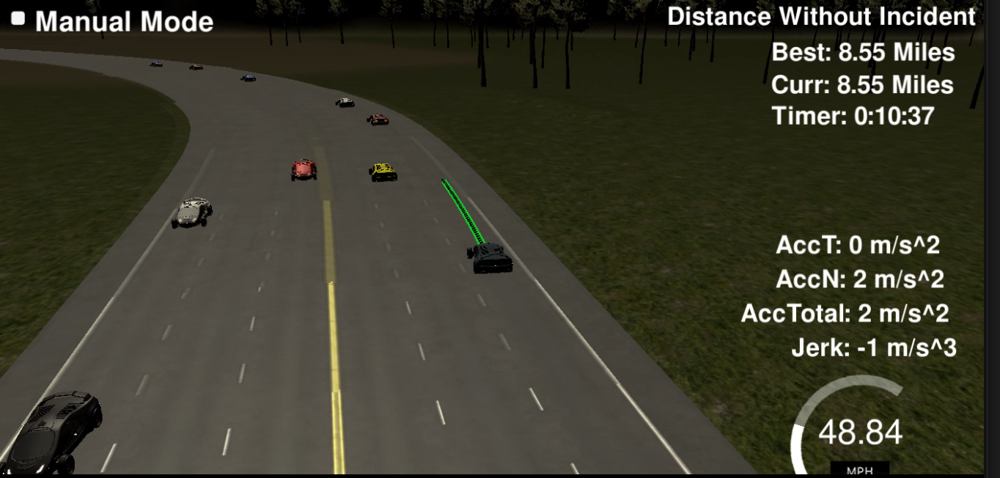

# CarND-Path-Planning-Project
Self-Driving Car Engineer Nanodegree Program
   
### Simulator.
You can download the Term3 Simulator which contains the Path Planning Project from the [releases tab (https://github.com/udacity/self-driving-car-sim/releases/tag/T3_v1.2).  

To run the simulator on Mac/Linux, first make the binary file executable with the following command:
```shell
sudo chmod u+x {simulator_file_name}
```

### Goals
In this project your goal is to safely navigate around a virtual highway with other traffic that is driving +-10 MPH of the 50 MPH speed limit. You will be provided the car's localization and sensor fusion data, there is also a sparse map list of waypoints around the highway. The car should try to go as close as possible to the 50 MPH speed limit, which means passing slower traffic when possible, note that other cars will try to change lanes too. The car should avoid hitting other cars at all cost as well as driving inside of the marked road lanes at all times, unless going from one lane to another. The car should be able to make one complete loop around the 6946m highway. Since the car is trying to go 50 MPH, it should take a little over 5 minutes to complete 1 loop. Also the car should not experience total acceleration over 10 m/s^2 and jerk that is greater than 10 m/s^3.

#### The map of the highway is in data/highway_map.txt
Each waypoint in the list contains  [x,y,s,dx,dy] values. x and y are the waypoint's map coordinate position, the s value is the distance along the road to get to that waypoint in meters, the dx and dy values define the unit normal vector pointing outward of the highway loop.

The highway's waypoints loop around so the frenet s value, distance along the road, goes from 0 to 6945.554.

## Basic Build Instructions

1. Clone this repo.
2. Make a build directory: `mkdir build && cd build`
3. Compile: `cmake .. && make`
4. Run it: `./path_planning`.

Here is the data provided from the Simulator to the C++ Program

#### Main car's localization Data (No Noise)

["x"] The car's x position in map coordinates

["y"] The car's y position in map coordinates

["s"] The car's s position in frenet coordinates

["d"] The car's d position in frenet coordinates

["yaw"] The car's yaw angle in the map

["speed"] The car's speed in MPH

#### Previous path data given to the Planner

//Note: Return the previous list but with processed points removed, can be a nice tool to show how far along
the path has processed since last time. 

["previous_path_x"] The previous list of x points previously given to the simulator

["previous_path_y"] The previous list of y points previously given to the simulator

#### Previous path's end s and d values 

["end_path_s"] The previous list's last point's frenet s value

["end_path_d"] The previous list's last point's frenet d value

#### Sensor Fusion Data, a list of all other car's attributes on the same side of the road. (No Noise)

["sensor_fusion"] A 2d vector of cars and then that car's [car's unique ID, car's x position in map coordinates, car's y position in map coordinates, car's x velocity in m/s, car's y velocity in m/s, car's s position in frenet coordinates, car's d position in frenet coordinates. 

## Details

1. The car uses a perfect controller and will visit every (x,y) point it recieves in the list every .02 seconds. The units for the (x,y) points are in meters and the spacing of the points determines the speed of the car. The vector going from a point to the next point in the list dictates the angle of the car. Acceleration both in the tangential and normal directions is measured along with the jerk, the rate of change of total Acceleration. The (x,y) point paths that the planner recieves should not have a total acceleration that goes over 10 m/s^2, also the jerk should not go over 50 m/s^3. (NOTE: As this is BETA, these requirements might change. Also currently jerk is over a .02 second interval, it would probably be better to average total acceleration over 1 second and measure jerk from that.

2. There will be some latency between the simulator running and the path planner returning a path, with optimized code usually its not very long maybe just 1-3 time steps. During this delay the simulator will continue using points that it was last given, because of this its a good idea to store the last points you have used so you can have a smooth transition. previous_path_x, and previous_path_y can be helpful for this transition since they show the last points given to the simulator controller with the processed points already removed. You would either return a path that extends this previous path or make sure to create a new path that has a smooth transition with this last path.

## Tips

A really helpful resource for doing this project and creating smooth trajectories was using http://kluge.in-chemnitz.de/opensource/spline/, the spline function is in a single hearder file is really easy to use.

---

## Dependencies

* cmake >= 3.5
  * All OSes: [click here for installation instructions](https://cmake.org/install/)
* make >= 4.1
  * Linux: make is installed by default on most Linux distros
  * Mac: [install Xcode command line tools to get make](https://developer.apple.com/xcode/features/)
  * Windows: [Click here for installation instructions](http://gnuwin32.sourceforge.net/packages/make.htm)
* gcc/g++ >= 5.4
  * Linux: gcc / g++ is installed by default on most Linux distros
  * Mac: same deal as make - [install Xcode command line tools]((https://developer.apple.com/xcode/features/)
  * Windows: recommend using [MinGW](http://www.mingw.org/)
* [uWebSockets](https://github.com/uWebSockets/uWebSockets)
  * Run either `install-mac.sh` or `install-ubuntu.sh`.
  * If you install from source, checkout to commit `e94b6e1`, i.e.
    ```
    git clone https://github.com/uWebSockets/uWebSockets 
    cd uWebSockets
    git checkout e94b6e1
    ```

## Editor Settings

We've purposefully kept editor configuration files out of this repo in order to
keep it as simple and environment agnostic as possible. However, we recommend
using the following settings:

* indent using spaces
* set tab width to 2 spaces (keeps the matrices in source code aligned)

## Code Style

Please (do your best to) stick to [Google's C++ style guide](https://google.github.io/styleguide/cppguide.html).

## Project Instructions and Rubric

Note: regardless of the changes you make, your project must be buildable using
cmake and make!


## Call for IDE Profiles Pull Requests

Help your fellow students!

We decided to create Makefiles with cmake to keep this project as platform
agnostic as possible. Similarly, we omitted IDE profiles in order to ensure
that students don't feel pressured to use one IDE or another.

However! I'd love to help people get up and running with their IDEs of choice.
If you've created a profile for an IDE that you think other students would
appreciate, we'd love to have you add the requisite profile files and
instructions to ide_profiles/. For example if you wanted to add a VS Code
profile, you'd add:

* /ide_profiles/vscode/.vscode
* /ide_profiles/vscode/README.md

The README should explain what the profile does, how to take advantage of it,
and how to install it.

Frankly, I've never been involved in a project with multiple IDE profiles
before. I believe the best way to handle this would be to keep them out of the
repo root to avoid clutter. My expectation is that most profiles will include
instructions to copy files to a new location to get picked up by the IDE, but
that's just a guess.

One last note here: regardless of the IDE used, every submitted project must
still be compilable with cmake and make./

# Writeup for submission

<p align="center">
  
</p>

---

## Path Planning Workflow
1. Check the closest waypoints
2. Interpolate waypoints
3. Check surrounding
4. Predict traffic
5. Update behaviours
6. Generate desired target
7. Generate new path

---

### Check the closest waypoints
```
Waypoints PathPlanner::detectClosestWaypoints(const Waypoints &map)
{
    int num_waypoints = map.x.size();
    int next_waypoint_index = nextWaypoint(x, y, yaw, map.x, map.y);

    Waypoints closest_waypoints = Waypoints();

    // Add closest waypoints information
    for (int i = -Planner::kNumWaypointsBehind; i < Planner::kNumWaypointsAhead; i++)
    {
        int idx = (next_waypoint_index + i) % num_waypoints;
        if (idx < 0)
        {
            // correct for wrap
            idx += num_waypoints;
        }
        // correct for wrap in s for spline interpolation (must be continuous)
        double current_s = map.s[idx];
        double base_s = map.s[next_waypoint_index];
        if (i < 0 && current_s > base_s)
        {
            current_s -= Road::kTrackLength;
        }
        if (i > 0 && current_s < base_s)
        {
            current_s += Road::kTrackLength;
        }
        closest_waypoints.x.push_back(map.x[idx]);
        closest_waypoints.y.push_back(map.y[idx]);
        closest_waypoints.s.push_back(current_s);
        closest_waypoints.dx.push_back(map.dx[idx]);
        closest_waypoints.dy.push_back(map.dy[idx]);
    }
    return closest_waypoints;
}
```

---

### Interpolate waypoints
```
Waypoints PathPlanner::interpolateWaypoints(const Waypoints &waypoints)
{
    Waypoints interpolated_waypoints{};
    float interval = Planner::kInterpolatedWaypointsInterval;
    double s_length = (waypoints.s[waypoints.s.size() - 1] - waypoints.s[0]); // use s to calcualte interpolation points
    int num_interpolation_points = s_length / interval;

    // Interpolate s
    interpolated_waypoints.s.push_back(waypoints.s[0]);
    for (int i = 1; i < num_interpolation_points; i++)
    {
        interpolated_waypoints.s.push_back(waypoints.s[0] + i * interval);
    }
    // Interpolate  the rest
    interpolated_waypoints.x = interpolate(waypoints.s, waypoints.x, interval, num_interpolation_points);
    interpolated_waypoints.y = interpolate(waypoints.s, waypoints.y, interval, num_interpolation_points);
    interpolated_waypoints.dx = interpolate(waypoints.s, waypoints.dx, interval, num_interpolation_points);
    interpolated_waypoints.dy = interpolate(waypoints.s, waypoints.dy, interval, num_interpolation_points);

    return interpolated_waypoints;
}
```

---

### Check surrounding
```
void PathPlanner::checkSurrounding()
{
    surrouding.reset();

    for (Detection &car : sensor_detections)
    {
        double s_diff = fabs(car.s - s);
        if (s_diff < Planner::kSaveDistance)
        {
            double d_diff = car.d - d;
            if (d_diff > 0.0F && fabs(d_diff) < 1.5 * Road::kWidth)
            {
                surrouding.car_on_right = true;
            }
            else if (d_diff < 0.0F && fabs(d_diff) < 1.5 * Road::kWidth)
            {
                surrouding.car_on_left = true;
            }
            else if (fabs(d_diff) < 0.5 * Road::kWidth)
            {
                surrouding.car_ahead = true;
            }
        }
    }
}
```

---

### Predict traffic
```
void PathPlanner::predictTraffic()
{
    double traj_start_time = subpath_size * Planner::dt;
    double duration = Planner::kNumSamples * Planner::kSampleDt - subpath_size * Planner::dt;
    predictions.clear();
    for (Detection &car_deteceted : sensor_detections)
    {
        double other_car_vel = sqrt(pow((double)car_deteceted.vx, 2) + pow((double)car_deteceted.vy, 2));
        int v_id = car_deteceted.id;

        std::vector<std::vector<double>> prediction{};
        for (int i = 0; i < Planner::kNumSamples; i++)
        {
            double t = traj_start_time + (i * duration / Planner::kNumSamples);
            double s_pred = car_deteceted.s + other_car_vel * t;
            vector<double> s_and_d = {s_pred, car_deteceted.d};
            prediction.push_back(s_and_d);
        }

        predictions[v_id] = prediction;
    }
}
```

---

### Update behaviours
```
void PathPlanner::updateBehaviourList()
{
    behaviour_list = {"KeepLane"};
    if (d > 4 && !surrouding.car_on_left)
    {
        behaviour_list.push_back("ChangeLeft");
    }
    if (d < 8 && !surrouding.car_on_right)
    {
        behaviour_list.push_back("ChangeRight");
    }
}
```

---

### Generate desired target
```
vector<vector<double>> PathPlanner::bestTarget()
{
    vector<vector<double>> best_target;
    double best_cost = std::numeric_limits<double>::max();
    double duration = Planner::kNumSamples * Planner::kSampleDt - subpath_size * Planner::dt;
    for (std::string behaviour : behaviour_list)
    {
        vector<vector<double>> target_s_and_d = calculateTarget(behaviour,
                                                                predictions,
                                                                duration);

        vector<vector<double>> possible_traj = calculateTrajectory(target_s_and_d, duration);

        double current_cost = calculateCost(possible_traj[0], possible_traj[1], predictions);
        if (current_cost < best_cost)
        {
            best_cost = current_cost;
            best_target = target_s_and_d;
        }
    }

    return best_target;
}
```

---

### Generate new path
```
void PathPlanner::generateNewPath(const vector<vector<double>> &target,
                                  const Waypoints &interpolated_waypoints,
                                  const Waypoints &previous_path,
                                  vector<double> &next_x_vals,
                                  vector<double> &next_y_vals)
{
    vector<double> coarse_s_traj, coarse_x_traj, coarse_y_traj, interpolated_s_traj,
        interpolated_x_traj, interpolated_y_traj;

    double prev_s = s - s_d * Planner::dt;

    // first two points of coarse trajectory, to ensure spline begins smoothly
    if (subpath_size >= 2)
    {
        coarse_s_traj.push_back(prev_s);
        coarse_x_traj.push_back(previous_path.x[subpath_size - 2]);
        coarse_y_traj.push_back(previous_path.y[subpath_size - 2]);
        coarse_s_traj.push_back(s);
        coarse_x_traj.push_back(previous_path.x[subpath_size - 1]);
        coarse_y_traj.push_back(previous_path.y[subpath_size - 1]);
    }
    else
    {
        double prev_s = s - 1;
        double prev_x = x - cos(yaw);
        double prev_y = y - sin(yaw);
        coarse_s_traj.push_back(prev_s);
        coarse_x_traj.push_back(prev_x);
        coarse_y_traj.push_back(prev_y);
        coarse_s_traj.push_back(s);
        coarse_x_traj.push_back(x);
        coarse_y_traj.push_back(y);
    }

    // last two points of coarse trajectory, use target_d and current s + 30,60
    double target_s1 = s + Road::kIntervalS;
    double target_d1 = target[1][0];
    vector<double> target_xy1 = getXY(target_s1, target_d1,
                                      interpolated_waypoints.s,
                                      interpolated_waypoints.x,
                                      interpolated_waypoints.y);
    double target_x1 = target_xy1[0];
    double target_y1 = target_xy1[1];
    coarse_s_traj.push_back(target_s1);
    coarse_x_traj.push_back(target_x1);
    coarse_y_traj.push_back(target_y1);
    double target_s2 = target_s1 + Road::kIntervalS;
    double target_d2 = target_d1;
    vector<double> target_xy2 = getXY(target_s2,
                                      target_d2,
                                      interpolated_waypoints.s,
                                      interpolated_waypoints.x,
                                      interpolated_waypoints.y);
    double target_x2 = target_xy2[0];
    double target_y2 = target_xy2[1];
    coarse_s_traj.push_back(target_s2);
    coarse_x_traj.push_back(target_x2);
    coarse_y_traj.push_back(target_y2);

    // next s values
    double target_s_dot = target[0][1];
    double current_s = s;
    double current_v = s_d;
    for (int i = 0; i < (Planner::kNumPathPoints - subpath_size); i++)
    {
        double v_incr, a_incr;
        if (fabs(target_s_dot - current_v) < 2 * Cost::kVelocityIncrementLimit)
        {
            v_incr = 0;
        }
        else
        {
            v_incr = (target_s_dot - current_v) / (fabs(target_s_dot - current_v)) * Cost::kVelocityIncrementLimit;
        }
        current_v += v_incr;
        current_s += current_v * Planner::dt;
        interpolated_s_traj.push_back(current_s);
    }

    interpolated_x_traj = interpolate(coarse_s_traj, coarse_x_traj, interpolated_s_traj);
    interpolated_y_traj = interpolate(coarse_s_traj, coarse_y_traj, interpolated_s_traj);

    // add previous path, if any, to next path
    for (int i = 0; i < subpath_size; i++)
    {
        next_x_vals.push_back(previous_path.x[i]);
        next_y_vals.push_back(previous_path.y[i]);
    }
    // add xy points from newly generated path
    for (int i = 0; i < interpolated_x_traj.size(); i++)
    {
        next_x_vals.push_back(interpolated_x_traj[i]);
        next_y_vals.push_back(interpolated_y_traj[i]);
    }
}
```

---

### Result
<p align="center">
  
</p>

Driven distance without accident : **8.55 miles**
